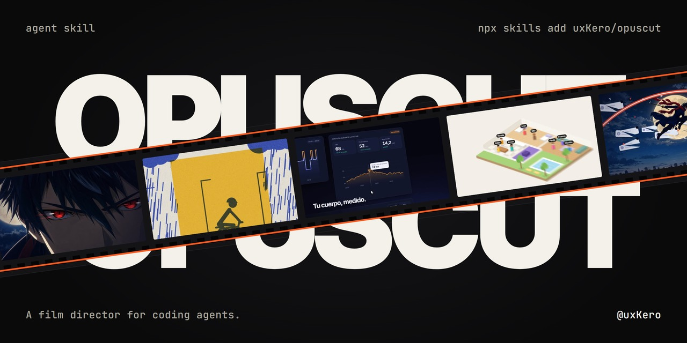
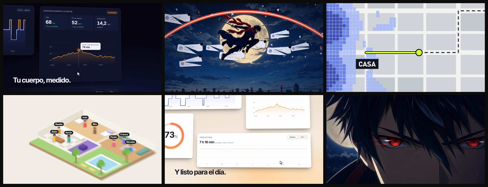

<div align="center">

# OPUSCUT

A film director for coding agents.

<a href="https://x.com/uxKero"></a> <a href="LICENSE"></a> <a href="opuscut/SKILL.md"></a> <a href="https://skills.sh/uxkero/opuscut/opuscut"></a>

<br><br>



</div>

<br>

Everyone is making promo videos with Opus 5.5, and they all look alike: the same fade-in, a timer in the corner, a cut every two seconds. OpusCut is a skill for that. Give it your repo, a brief or a video you like, and it works out the style and the pace, uses your real app and footage, and remembers what you liked for the next one. Built for Opus 5.5, works with any model that reads skills.



## What is inside

- Asks only what is missing, and lets you bring your own idea.
- 25 styles, from editorial and isometric to anime and product UI.
- A pace picked for the video: calm, measured or fast, never fast by default.
- Uses your app, footage, 3D and logo before drawing anything.
- Reads reference videos: the cuts, the pace, the palette, the drawing style.
- Keeps a note of what you liked in each project.

## Install

```bash
npx skills add uxKero/opuscut
```

Or copy the `opuscut` folder where your agent reads skills, then restart the agent.

| Agent | Personal | Per project |
|:--|:--|:--|
| Codex | `~/.agents/skills/` | `.agents/skills/` |
| Claude Code | `~/.claude/skills/` | `.claude/skills/` |
| Cursor | `~/.cursor/skills/` | `.cursor/skills/` |

```bash
git clone https://github.com/uxKero/opuscut.git
cp -r opuscut/opuscut ~/.agents/skills/
```

It renders on your machine, so it needs Python and [ffmpeg](https://ffmpeg.org). The first time, install the rest:

```bash
pip install -r opuscut/requirements.txt
python -m playwright install chromium
```

<br>

<div align="center">

Made by [@uxKero](https://x.com/uxKero) under the [MIT License](LICENSE).

</div>
